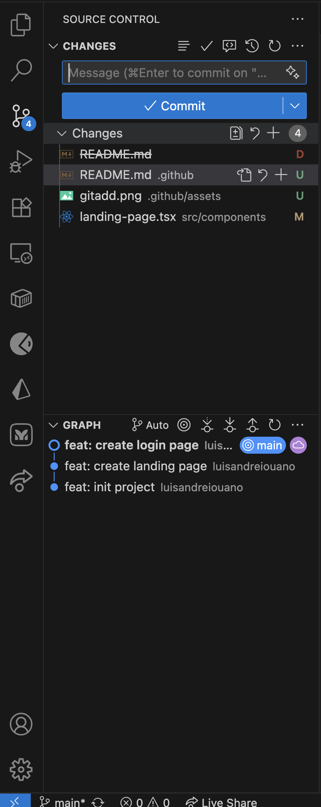
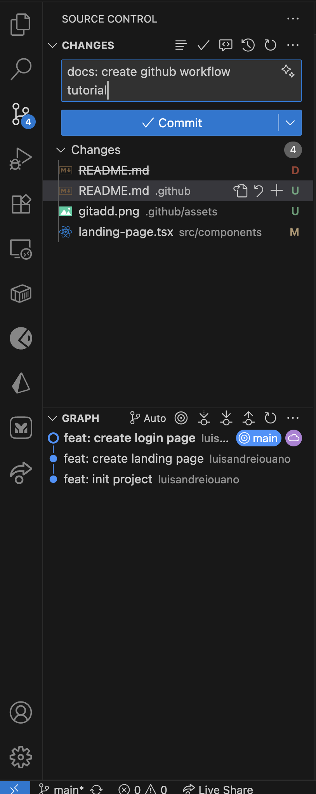

# GITHUB WORKFLOW
1. Open your terminal (for windows use git bash)

```bash
# create a branch and navigate to it (replace "dashboard" with the name of the branch you are working on)
git checkout -b feat/dashboard
```

2. Make changes, code your work
```javascript
export default function HelloPage(){
  return (
    <div>
      Hello World!
    </div>
  )
}
```

3. Click the plus button beside the "Changes" tab to git add all your work


4. Git commit your work


5. If this is a new branch, click "Publish Branch, if its an existing one click "Sync Changes". Go to github, a notification will popup that says your branch has pushed new changes. Click create "Compare and pull request" write the title and put what you did in the description box, then click "Create pull request".

6. Copy the link of the url (the link of your pull request), and send it to your team members for review and approval.

7. They will approve and merge those changes. Done!